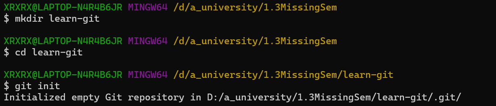
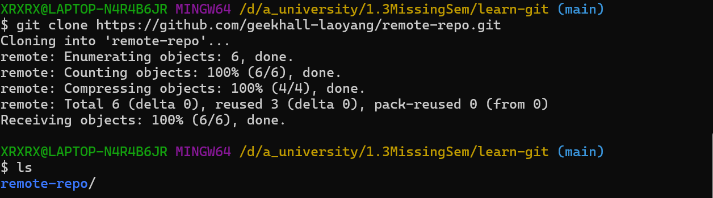

## 新建仓库/版本库/repository
先进入你要创建仓库的文件夹
```
git init
```

``` 
git clone https://github.com/geekhall-laoyang/remote-repo.git

```

## git 工作区域和文件状态
working diretory

staging area/index

local repository 本地仓库