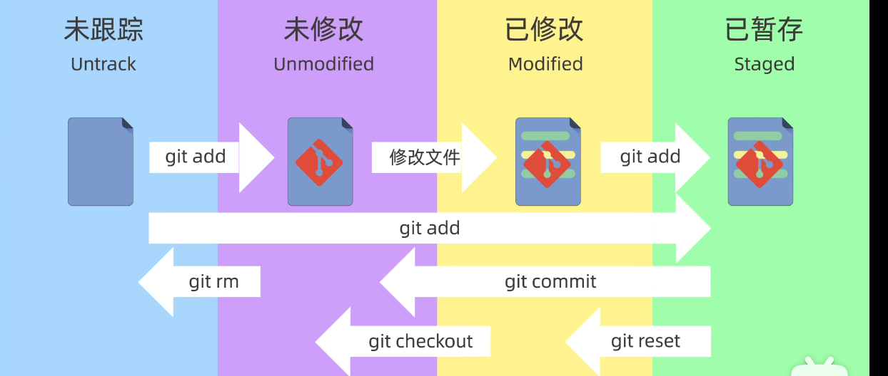

## 新建仓库/版本库/repository
先进入你要创建仓库的文件夹
```
git init
```

``` 
git clone https://github.com/geekhall-laoyang/remote-repo.git
```
查看仓库状态
```
git status
```

## git 工作区域和文件状态
working diretory 工作区

staging area/index 暂存区

local repository 本地仓库



### 命令行
开始跟踪/取消跟踪一个文件到暂存区
```
git add 文件名
git restore --staged 文件名
```
所有文件都添加，可以使用``git add .``或者``git add *.txt``

提交到仓库中，只会把全部在暂存区的文件提交
``` 
git commit "提交信息"
```
查看更新日志
```
git log
```
按q退出

回退版本
```
git reset
```

### 在vscode界面的情况
输入消息点击提交
- 如果暂存区有文件，只会把暂存区的文件提交
- 如果暂存区没有文件，会自动把更改中未跟踪和已修改的文件进行add 并 commit
